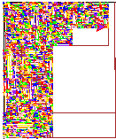

# [L08: Recursive Art](https://docs.google.com/document/d/1Ty7-La9W8I_k7h6FW1GKGbwDBfmH45OR8sEgPG-sc9w/edit?usp=sharing)

## Use randomness, recursion, and turtles to create art in the style of Piet Mondrian, 

### Starter files have been provided for you in C++

### Author(s):
- Author of primary logic: Thy H. Nguyen
- Author of lab and stubs: Jan Pearce, Berea College
- Author of [C-Turtle](https://github.com/walkerje/C-Turtle): Jesse W. Walker

### Final Image:

# Planning Prompts

1. **RECURSION**
*When the steps say “Use Recursion to…”, 
describe exactly what it is telling you to do*

Use Turtle and Recursion to create art, in the style of Piet Mondrian.

2. **PARAMETERS** 
*Give some serious thought to what parameters need to be utilized by 
your recursive function. You will basically need to know:*
- where to start to draw the rectangle,
- how wide it should be, 
- how tall it should be, and 
- what color it should be. 
*Using all of this, information, describe the parameters you plan to use.*

First, setting up the largest rectangle with the width of 800 and the height of 600
Start draw the rectanlge at the point of (x,y) of the coordinate (-400,300)
It means starting with the entire screen’s size as a rectangle, wherein the top left hand corner is the coordinate
x=400, y=300. 
The width of it should be 800
The height of it should be 600
The color is random.

There are 9 colors include "black","orange","brown","purple","green", "blue", "red", "yellow", "pink"

Parameters: draw_modrian_art.mondrian(myPoints, width, length, turtle)

3. **BASE CASE** 
*Given the above series of steps uses the recursive method, 
what is the base case? Explain.*

The base case is the smallest rectangle (decided by me), it has the width of 3 and the height of 2.
The reason is that Whether or not a rectangle is big/small enough to split is up to my discretion!

4. **RANDOM NUMBER**
*Explain how the recursion minimum and recursion maximum 
just discussed relate to the base case for your recursion.*

Recursion minimum is some number depends on the random number.
Recursion maximum is also random, so it cannot be counted.
As the width is 3 and the height is 2 (base case), it takes a lot of long time to complete this work of art!

5. **RANDOM NUMBER COMPUTATION**
*Assuming you know the coordinate of your upper left corner and 
the width of your original rectangle. 
Given that the random number generator that I gave you generates a 
random number between 1 and a random max, 
how will you generate an appropriately sized random number and 
how will you use it for your next function call?*

Generate an appropriately sized random number is done by taken the random number of the width and height of the current region.
Use it with the conditions of the height and width greater than the minimum for my next function call.

6. **WHITEBOARD DESIGN**
*Write a high level design plan for your program.
You can use screenshots of your work on an actual white board 
or you can use pseudocode.*

If the region is wider than half the initial canvas size and the region is taller than half the initial canvas height:
(This means if the width is greater than 400, and the height is greater than 300)

Use recursion to split the region into 4 smaller regions (a vertical split and a horizontal split) with both split
locations chosen randomly.
(As the two splits are random, we will have 4 small rectangles, but we do not know the size of the rectangles.)

else if the region is wider than half the initial canvas size:
(This means if the width is greater than 400, but the height is smaller or equals to 300)

Use recursion to split the region into 2 smaller regions using a vertical line with the split location chosen randomly.
(As we split vertically we will have 2 small rectangles. We know the size of the height, which is the same size as the previous rectangles, 
which is still the old height - as the height does not change, but we do not know the size of the width of the rectangles.)

else if the region is taller than half the initial canvas size:
(This means if the width is smaller or equals to 400, but the height is greater than 300)

Use recursion to split the region into 2 smaller regions using a horizontal line with the 	split location chosen randomly.
(As we split horizontally we will have 2 small rectangles. We know the size of the width, which is the same size as the previous rectangles, 
which is still the old width - as the width does not change, but we do not know the size of the height of the rectangles.)

else if the region is big enough to split both horizontally and vertically, and both a horizontal and vertical split are randomly selected:
(The region is big enough when the width is greater than 0 and the height is greater than 0)

Use recursion to split the region into 4 smaller regions (a vertical split and a horizontal    split) with both split locations chosen randomly.
(As the two splits are random, we will have 4 small rectangles, but we do not know the size of the rectangles.)

else if the region is wide enough* to split horizontally, and a horizontal split is randomly selected:
(This means if the width is greater than 3 and the height is smaller than or equal to 2)

Use recursion to split the region into 2 smaller regions using a vertical line with the split location chosen randomly.
(As we split vertically we will have 2 small rectangles. We know the size of the height, which is the same size as the previous rectangles, 
which is still the old height - as the height does not change, but we do not know the size of the width of the rectangles.)

else if the region is tall enough* to split vertically, a vertical split is randomly selected:
(This means if the width is smaller than or equal to 3 and the height is greater than 2)

Use recursion to split the region into 2 smaller regions using a horizontal line with the 	split location chosen randomly.
(As we split horizontally we will have 2 small rectangles. We know the size of the width, which is the same size as the previous rectangles, 
which is still the old width - as the width does not change, but we do not know the size of the height of the rectangles.)

else:
Fill the current region (randomly, either white or colored, and if colored, with a random determination of my random 9 colors).
(So we will fill the rectangle with the width and height with the color and really draw it.)

# Implementation and Customization Prompts

7. **SPLITTING**
*How many “units” wide or tall did you consider a 
rectangle too small to split?*

I consider 3 units wide and 2 units tall.
So I split into a lot of rectangles.

8. **NUMBER CALLS**
*While filling out the above rectangle in the Mondrian’s style 
using the series of steps above, 
is there anything you noticed that will change how many times the 
recursive function gets called?*

I think the recursive function gets called will change depend on the random width and random height that we have.
However, I think the best case is only 1 recursion (calling the function only one), but that case does not work in my coding.
(As I set the minimum height is 2 and minimum width is 3).

9. **EXTRA STEPS**
*Most design choices have advantages as well as disadvantages. 
Given the above series of steps, 
are there any steps you felt were unnecessary given what other steps perform?*

I do not think there are any steps I felt were unnecessary given to perform.

10. **DISADVANTAGE**
*Describe and explain at least one disadvantage of using recursion to 
generate Mondrian art.*

One disadvantage of using recursion: Sometimes, there are so many recursion (If the minimum width and the minimum height 
decided by the users is a really small number, for example, the width is 2 and the height is 1.)
It takes so long time just to generate the work of art.

11. **REQUIRED CUSTOMIZATIONS**
*What customizations did you make Mondrian art, and why did you choose it.*

I made customazations to the Mondrian Art. I chose it because it looked good. It looks fancy like fractal pixel.

12. **PROCESS SUMMARY**
*Briefly summarize your design and implementation process, 
including how much your initial design plan evolved, 
the final results you achieved, and the amount of time you spent 
as a programmer or programmers in accomplishing these results. 
This should be one or at most two paragraphs.*

My design and implementation process went well.

13. **DESIGN CHALLENGES**
*Describe the primary conceptual challenges that you encountered 
in trying to complete this lab and what might have made the 
lab easier for you.*

There is no challenge.

14. **BIG O ANALYSIS**
*Please analyze the Big O of all of the methods of the MondrianArt class, 
including constructors. 
Hint: Given the random nature of this lab, 
be sure you write about the worst case.*

The best case is a constant - if the person sets the height and width the same as the original, we have only 1 rectangle.
The worst case is exponential - in my case.

15. **TESTING**
*Please briefly describe your testing process. 
Here you should be careful to select representative input cases, 
including both representative typical cases as well as extreme cases.*

All extreme cases pass.

16. **ERRORS**
*List in bulleted form of all known errors 
and deficiencies with a very brief explanation.*

No error.

17. **LEARNING AND REACTION**
*A paragraph or so of your own comments 
on what you learned and your reactions to this lab.*

I have learned how to make Mondrian Art. My reaction to this lab is that it is fun.

18. **INTEGRITY STATEMENT**
*Please briefly describe ALL help you received and 
all help you gave to others in completing this lab.
Also list all other references below.*

I received no help in completing this lab.

## References:
- This repo contains code by Jan Pearce and Jesse Walker as described above.
- The linked lab heavily leverage nifty.stanford.edu/2018/stephenson-mondrian-art/
- No other references. (To be updated if needed)
